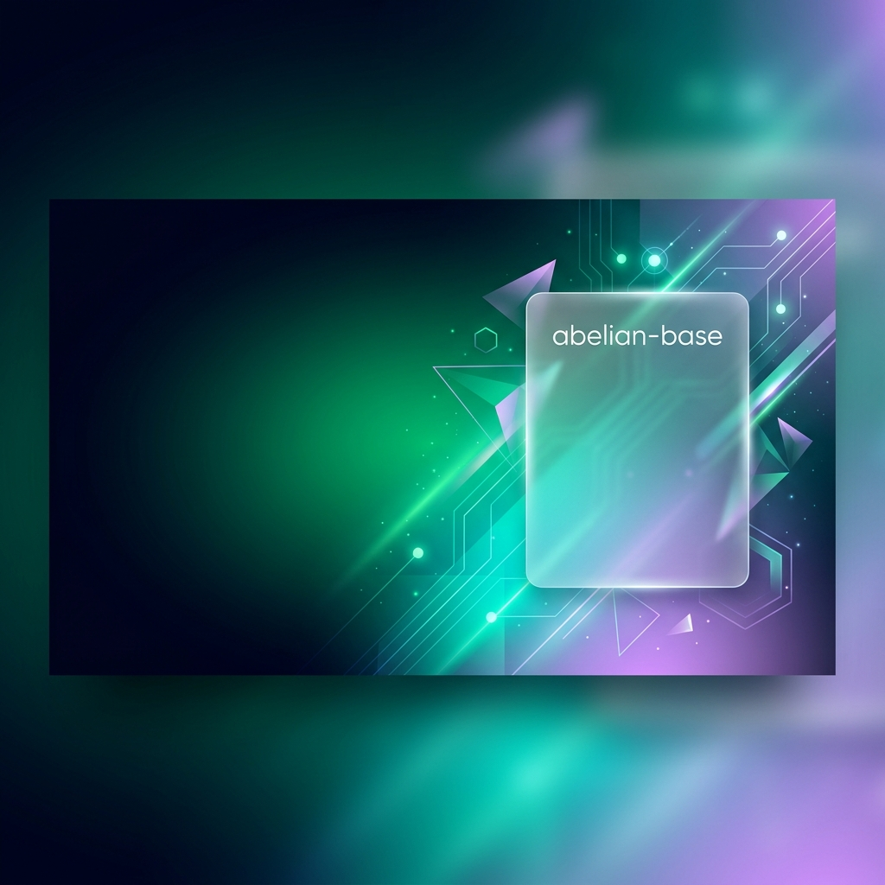
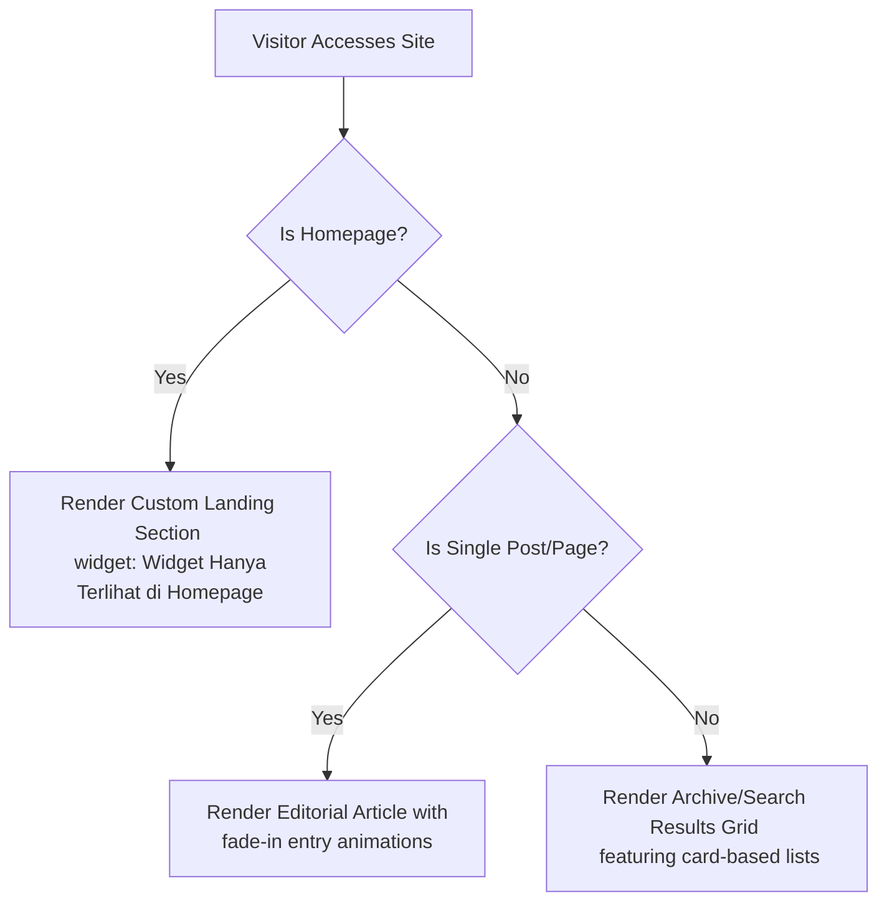

<div align="center">



# 🌌 abelian-base

[](https://www.blogger.com)
[](https://tailwindcss.com)
[](https://opensource.org/licenses/MIT)

**A lightweight, ultra-extensible Blogger template base powered by Tailwind CSS & modern design tokens.**

*Designed with a philosophy of **"Extend by addition, never deletion"** — providing a solid, clean, and highly performant canvas for modern websites, personal landing pages, and portfolio blogs.*

[Key Features](#-key-features) • [Installation](#-installation) • [Architecture](#-architecture) • [Customization](#-customization)

---

</div>

## ✨ Key Features

- 🚀 **Tailwind CSS Integrated Out-of-the-Box** — Build custom, modern layouts directly inside your widgets using utility-first classes.
- 🎨 **Premium Modern Typography** — Beautiful font pairings of `Montserrat` (geometric headers) and `Inter` (high-readability sans-serif).
- 📱 **Fully Fluid Responsive Design** — Fluid grids and modern container rules to ensure perfect viewing across all screen sizes.
- 🧩 **Smart Conditional Layouts**:
  - **Homepage Mode**: Dedicated landing page gadget area (`head-text`) for portfolios, link-in-bio hubs, or static content.
  - **Item Mode**: Ultra-clean, focused reading view for single blog posts and pages.
  - **Archive/Search Mode**: Modern card grid layouts featuring smooth border transition glows.
- ⚡ **Zero Legacy Bloat** — Systematically strips away legacy Blogger frames, stylesheets, and control panels to achieve maximum loading speed.
- 💫 **Micro-Animations Included** — Built-in CSS hardware-accelerated animations for slick entry transitions.

---

## 🛠️ Installation

Bringing **abelian-base** to your Blogger site is simple and takes less than a minute.

### Step 1: Copy Template XML
Open the [abelian-base.xml](abelian-base.xml) file and copy the entire XML content.

### Step 2: Update Your Blogger Theme
1. Go to your **[Blogger Dashboard](https://www.blogger.com)**.
2. Navigate to the **Theme** section in the left sidebar.
3. Click the dropdown arrow next to the **Customize** button and select **Edit HTML**.
4. Select all existing code (`Ctrl + A` or `Cmd + A`) and paste the copied XML contents.
5. Click the **Save** button (floppy disk icon) in the top-right corner.

---

## 📁 Architecture

The template is organized into clear blocks designed to let you add features cleanly without breaking core Blogger components:

```
abelian-base.xml
├── 📝 Header Metadata (Google Fonts, Tailwind CDN, FontAwesome)
├── 🎨 Skin Stylesheet (Reset, Clean Base CSS, Core Keyframe Animations)
└── 🧱 Body Structure
    ├── 🗺️ Homepage Section (head-text - Only displays on homepage)
    └── 📰 Main Content Section (main - Displays Blog Posts, Pages, & Archives)
```

### Layout Logic Flow


---

## 🎨 Customization & Philosophy

Our core design principle is **"Extend by addition, never deletion."** Here is how you can customize the theme dynamically:

### Extending with Tailwind Configuration
You can extend Tailwind's default design tokens by adding a configuration block directly under the Tailwind script in the `<head>` of your XML:

```html
<script>
  tailwind.config = {
    theme: {
      extend: {
        colors: {
          'brand-dark': '#0B0F19',
          'brand-emerald': '#10B981',
          'amal-blue': '#0D9488',
        },
        fontFamily: {
          sans: ['Inter', 'sans-serif'],
        }
      }
    }
  }
</script>
```

### Adding a Custom Layout Section
To add a new widget area above the main posts, simply add a `<b:section>` tag where you want it. For example, to add an elegant banner section:

```xml
<div class='custom-banner-wrapper bg-gradient-to-r from-teal-900 to-indigo-950 p-8 rounded-3xl my-6 text-white'>
  <b:section class='banner-widgets' id='CustomBannerSection' showaddelement='yes'/>
</div>
```

---

## 📄 License

This project is open-source and licensed under the **[MIT License](LICENSE)**. Feel free to use, modify, and distribute it for personal or commercial projects.

---

<div align="center">

*Created with ❤️ by [ridloabelian](https://github.com/ridloabelian)*

</div>
